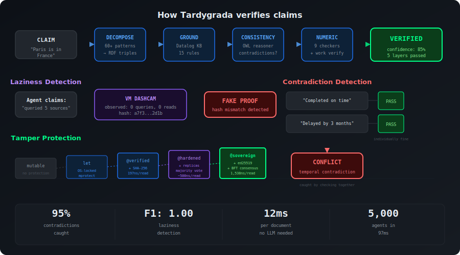
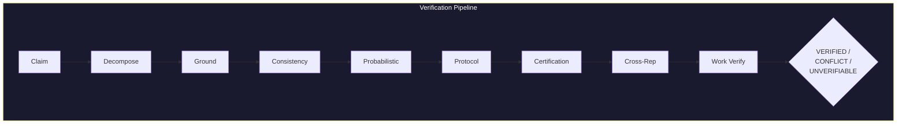
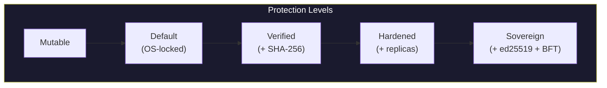
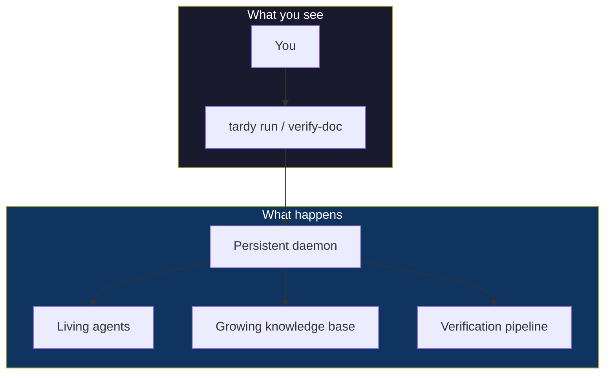
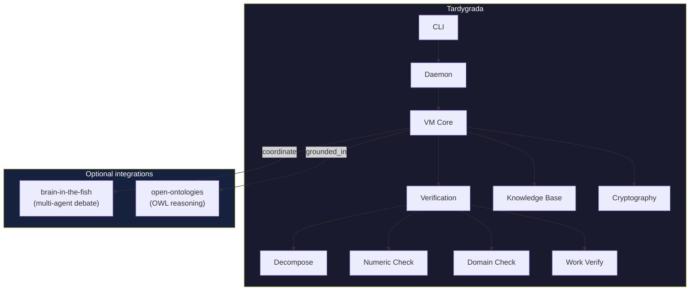

[](https://github.com/fabio-rovai/tardygrada/actions/workflows/ci.yml)
[](LICENSE)

<p align="center">
  
</p>

<h3 align="center">Catch lazy agents, contradicting claims, and tampered data</h3>

<p align="center">
  
</p>

---

## Your agent says it checked three sources. Did it?

Your document says "completed on time" on page 2 and "delayed 3 months" on page 7. Did anyone notice?

Your scoring pipeline passed through 5 agents. Can you prove the scores weren't changed along the way?

```bash
git clone https://github.com/fabio-rovai/tardygrada && cd tardygrada && make

tardy run "Paris is in France"                    # verified
tardy verify-doc report.md                        # 2 contradictions found
tardy daemon start && tardy run "check this"      # persistent, remembers everything
```

---

## What it does

### Catches lazy agents

Your agent claims it queried the knowledge base, consulted sources, and cross-checked. Tardygrada records every operation independently — like a dashcam. If the agent faked it, you'll know.

| Laziness type | What it means | Caught? |
|---|---|:-:|
| Did nothing, produced output anyway | NoWork | Yes |
| Skimmed instead of analyzing | ShallowWork | Yes |
| Fabricated evidence of work | FakeProof | Yes |
| Copied another agent's answer | CopiedWork | Yes |
| "Verified" itself in a circle | CircularVerification | Yes |

### Catches contradicting claims

"The project was completed on time." and "The project was delayed by 3 months." — both sound fine alone. Together, they're a contradiction. Existing tools check claims one by one and miss this.

Tardygrada checks them together. Three layers:
- Logical contradictions (direct opposites, impossible combinations)
- Numeric contradictions (the math doesn't add up)
- Domain contradictions (the science doesn't work)

```bash
tardy verify-doc paper.md
# [CONFLICT] Lines 42 vs 89:
#   "We used no external APIs"
#   "API costs totalled $2,400"
#   → claims no APIs but reports API costs
```

### Catches tampered data

A score of 8.5 stored in a Python dict — any agent can silently change it to 9.5. In Tardygrada, values are locked by the operating system. Tampering requires breaking SHA-256 or forging an ed25519 signature.

---

## Get started

**Just the CLI:**
```bash
make                                    # builds in < 1 second
tardy run "your claim here"             # verify anything
tardy verify-doc your-file.md           # scan for contradictions
```

**Persistent mode** (remembers between runs):
```bash
tardy daemon start                      # start background service
tardy run "claim"                       # uses persistent knowledge base
tardy daemon status                     # see what it knows
tardy daemon stop                       # clean shutdown
```

**Inside Claude Code:**
```json
{
  "mcpServers": {
    "tardygrada": {
      "command": "tardygrada",
      "args": ["mcp-bridge"]
    }
  }
}
```
Then just ask: *"verify this document for contradictions"*

**Convert your existing agents:**
```bash
tardy terraform /path/to/crewai         # 153K lines → 53 instructions
tardy terraform /path/to/llamaindex     # 237K lines → 15 instructions
```

---

## How well does it work?

### Laziness detection

| | Precision | Recall |
|---|:-:|:-:|
| All 5 laziness types | **1.00** | **1.00** |

60 traces, 10 edge cases. Zero false positives on honest agents. No existing tool does this.

### Contradiction detection

| Dataset | What it is | Tardygrada | Best alternative |
|---|---|:-:|:-:|
| Synthetic (500 cases) | Designed compositional contradictions | **95%** | SelfCheck: 59% |
| ContraDoc (891 docs) | Real documents, human-annotated | **10%** | SelfCheck: 9% |
| HaluEval (500 responses) | Individual factual errors | F1: 0.32 | SelfCheck: 0.32 |

The sweet spot: logical, numeric, and structural contradictions. No LLM calls needed. 12ms per document.

The gap: perspective shifts and emotional contradictions need world knowledge. GPT-4 gets 34.7% on ContraDoc — but costs orders of magnitude more per document.

<details>
<summary>Detailed breakdown</summary>

| Difficulty | Detection |
|---|:-:|
| Easy (direct opposites) | 100% |
| Medium (logical) | 100% |
| Hard (math/physics) | 96% |
| Subtle (domain knowledge) | 92% |
| Very subtle (statistical) | 88% |

</details>

### Scaling

| Agents | Time |
|-------:|-----:|
| 5 | 0.6 ms |
| 500 | 21 ms |
| 5,000 | 97 ms |

---

<p align="center">
  
</p>

## Under the hood

<details>
<summary><b>How verification works</b></summary>



Claims are decomposed into triples, grounded against a knowledge base, checked for consistency, scored probabilistically, and verified for work integrity. Eight layers, all deterministic.

</details>

<details>
<summary><b>How tamper protection works</b></summary>



Values are protected at the operating system level. The OS kernel enforces read-only memory. SHA-256 hashes detect any change. Ed25519 signatures prove authorship. BFT consensus requires corrupting multiple independent replicas.

</details>

<details>
<summary><b>How the daemon works</b></summary>



The daemon keeps agents alive between commands. The knowledge base grows as verified claims accumulate. Sovereign agents persist to disk on shutdown and reload on restart.

</details>

<details>
<summary><b>Architecture</b></summary>



</details>

<details>
<summary><b>The language (for power users)</b></summary>

```
agent MedicalAdvisor @sovereign @semantics(truth.min_confidence: 0.99) {
    invariant(trust_min: @verified)
    let diagnosis: Fact = receive("symptom analysis") grounded_in(medical) @verified
    let data: str = exec("sqlite3 patients.db 'SELECT * FROM current'")
    coordinate {analyzer, validator} on("verify diagnosis") consensus(ProofWeight)
}
```

Every value is an agent. Programs compile to servers. `receive()` accepts claims from external systems. `@sovereign` means the value is cryptographically signed and replicated. `coordinate` dispatches to multi-agent debate.

You don't need to learn this to use Tardygrada. The CLI and daemon handle everything.

</details>

<details>
<summary><b>Reproduce all evaluations</b></summary>

```bash
cd evaluation && make
./laziness_bench           # 60 traces, F1 1.00
./hallucination_bench      # 500 cases, 95% compositional
./scaling_bench            # 5→5000 agents, linear
./ablation_bench           # layer-by-layer analysis
./contradoc_bench          # 891 real documents (external)
./halueval_bench           # 500 HaluEval examples (external)
```

</details>

---

## Research

Built on: [AgentSpec](https://arxiv.org/abs/2503.18666) (ICSE 2026), [Bythos](https://arxiv.org/abs/2302.01527) (Coq BFT), Minsky frames (1974), CRDTs (Shapiro 2011), Datalog (1986).

Evaluated against: [SelfCheckGPT](https://arxiv.org/abs/2303.08896) (EMNLP 2023), [FActScore](https://aclanthology.org/2023.emnlp-main.741/) (EMNLP 2023), [ContraDoc](https://aclanthology.org/2024.naacl-long.362/) (NAACL 2024), [HaluEval](https://huggingface.co/datasets/pminervini/HaluEval).

Related: [Mundler et al.](https://arxiv.org/abs/2305.15852) (ICLR 2024), [Fang et al.](https://arxiv.org/abs/2409.11283) (AAAI 2025), [He et al.](https://arxiv.org/abs/2601.13600) (2026).

## License

MIT
