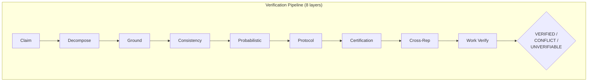
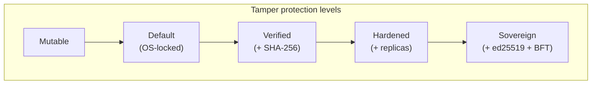
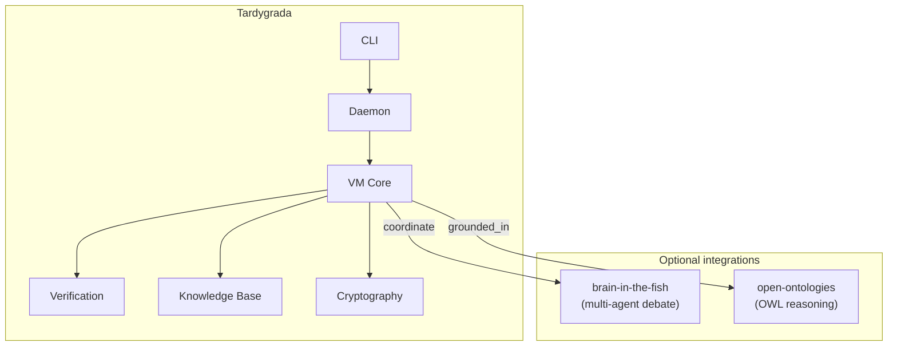

[](https://github.com/fabio-rovai/tardygrada/actions/workflows/ci.yml)
[](LICENSE)

<p align="center">
  
</p>

<h3 align="center">A verified runtime for trustworthy AI agents.</h3>
<p align="center">Every claim an agent makes passes an 8-layer verification pipeline <em>before</em> it counts — deterministic checks, explainable verdicts, no LLM judging an LLM.</p>

---

## What this is

Today's AI agents cannot prove their outputs are true. The standard mitigations
are structural non-starters: post-hoc monitors flag errors after they are acted
on, and LLM-judges inherit the failure mode they are meant to catch. Tardygrada
inverts the architecture: **outputs are gated before release**, by a pipeline
of independent checks that are deterministic wherever determinism is possible,
and every verdict names the layer and the evidence that decided it.

**Two things in one 350 KB C binary.**

1. **The verification runtime.** Catches contradictions between claims, claims
   that conflict with an attached ontology, numbers that don't add up, agent
   traces that *say* they did work but didn't, and tampered intermediate data.
   Plugs into Claude Code, Cursor, or Qwen Code as an MCP server.

2. **A language for verifiable agent programs.** `.tardy` files declare what an
   agent must establish (`receive()` slots), under what semantics
   (`truth.min_confidence`, `pipeline.min_passing_layers`), with what
   invariants. Compiled programs run as MCP servers — a curriculum a generic
   agent picks up, with the pipeline as the exam.

The pipeline (see [`src/verify/pipeline.h`](src/verify/pipeline.h)):

| # | Layer | Nature |
|---|---|---|
| 1 | Decompose — text to triples, independent decomposers | deterministic |
| 2 | Ontology grounding — triples vs knowledge graph | deterministic |
| 3 | Consistency — OWL reasoning for contradictions | deterministic |
| 4 | Probabilistic scoring — conjunction-safe aggregation | quantitative |
| 5 | Protocol — session-type compliance | deterministic |
| 6 | Formal certification — proof-certificate primitives | building block |
| 7 | Cross-representation bridge — layers must agree | deterministic |
| 8 | Work verification — laziness / fake-work detection | deterministic |

Verdicts are three-valued by design: `VERIFIED`, `CONFLICT`, or
`UNVERIFIABLE` — the runtime never converts "could not decide" into either
answer. Layer 4's aggregation is conjunction-safe (geometric mean plus a
weakest-link floor: one unsupported triple cannot hide behind nine strong
ones), and learned rule confidence is a capped Beta posterior — repetition
alone can never manufacture certainty, and contradicting evidence lowers it.

## Research programme

A Phase 1 feasibility study on this runtime runs from October 2026. The
scientific question is composition: the layers are individually
validated (numbers below), and Phase 1 measures whether their composition
lifts real-document detection past fixed gates — F1 ≥ 0.70 and precision
≥ 0.90 on ContraDoc-class data at p95 < 500 ms — with all evaluation code and
gates in [`evaluation/`](evaluation/), reproducible offline. The current
work item, derived from a measured failure analysis of the document detector's
evidence quality, is licence-based conflict detection: a differing-value pair
counts as evidence only when the predicate licenses uniqueness or the values
are demonstrably incompatible.

---

## Quick start

```bash
git clone https://github.com/fabio-rovai/tardygrada && cd tardygrada && make
# Builds in ~3 seconds. ~350 KB binary. Zero runtime deps.

# 60-second guided tour of every working feature
./demo/demo.sh

# Or step through it one section at a time
./demo/demo.sh --pause

# Try the verifier on a document
./tardygrada verify-doc README.md

# Start the persistent daemon
./tardygrada daemon start
./tardygrada status

# Open the live dashboard (treemap of the loaded ontology +
# claim verification panel; cells glow when a claim grounds)
make dashboard
# then visit http://127.0.0.1:8765
```

**Plug into Claude Code** (MCP):

```json
{
  "mcpServers": {
    "tardygrada": {
      "command": "/path/to/tardygrada",
      "args": ["mcp-bridge"]
    }
  }
}
```

The bridge exposes five tools: `verify_claim`, `verify_document`, `spawn_agent`, `read_agent`, `daemon_status`. Then in Claude: *"verify this document for contradictions"*.

**Plug into Qwen Code** (newline-delimited JSON-RPC adapter):

```json
{
  "mcpServers": {
    "tardygrada": {
      "command": "/bin/bash",
      "args": ["/path/to/tardygrada/hooks/targy-mcp-wrapper.sh"]
    }
  }
}
```

---

## Your first specialization

A worked example. A generic agent picks up the curriculum at
[`examples/code-review.tardy`](examples/code-review.tardy) and comes out a
code reviewer whose claims are gated by the pipeline.

```bash
# 1. Start the curriculum as an MCP server (stdio).
#    The agent CodeReviewer spawns with @sovereign trust, three
#    receive() slots, and pipeline.min_passing_layers = 5.
./tardygrada examples/code-review.tardy
```

What that prints:

```text
[tardygrada] agent CodeReviewer spawned
[tardygrada]   @semantics(truth.min_confidence: 0.85)
[tardygrada]   @semantics(pipeline.min_passing_layers: 5)
[tardygrada]   invariant(trust_min)
[tardygrada]   invariant(non_empty)
[tardygrada]   receive("code change description") -> pending
[tardygrada]   receive("author description of the change") -> pending
[tardygrada]   receive("complexity claim") -> pending
[tardygrada] MCP server starting on stdio
```

The three `receive(...) -> pending` slots are the curriculum the agent has to
fill in. Any MCP client (Claude Code, Cursor, a script) can submit claims to
them. The verification pipeline runs over each claim before it is allowed to
resolve.

**Submit a claim via MCP** (raw JSON-RPC, for illustration):

```json
{
  "jsonrpc": "2.0", "id": 1,
  "method": "tools/call",
  "params": {
    "name": "submit_claim",
    "arguments": {
      "agent": "complexity_claim",
      "claim": "The lookup is O(n) with a single pass over the input"
    }
  }
}
```

Then `verify_claim` on the same agent runs the 8-layer pipeline. If the
description elsewhere in the curriculum says the change adds a nested loop,
the lexical implicit-relation layer fires on the `nested_loop -> O(n^2)`
cue pattern and the claim resolves to `CONFLICT`, not `VERIFIED`.

That is the design in one example: *the agent is generic, the curriculum is
specific, and the verification pipeline decides what counts*.

---

## What works today (honest list)

| Capability | Status | Number |
|---|---|---|
| Real-document contradiction detection (ContraDoc, 891 docs) | Real benchmark on real data | **F1 0.57** (LexBase 0.16, FActScore 0.09) |
| Agent-trajectory hallucination detection (AgentHallu, 693 trajectories) | Real benchmark on real data | **F1 0.58** |
| Compositional contradiction suite (650 cases: 500 clear + 150 adversarial) | Designed-for-it; adversarial split added in v2.0 | **clear F1 1.00, 0 FP; combined 0.95; 18 µs/doc** |
| Laziness / fake-work detection (synthetic adversarial traces, 100) | Synthetic, designed-for-it | **F1 0.92, 0 false positives** |
| Memory tampering detection (OS mprotect + SHA-256 + ed25519) | Real OS-level enforcement | n/a |
| VM scaling (5 → 5,000 agents) | Real | ~92 ms total |
| MCP bridge (Claude Code, Qwen Code, Cursor) | Real, four of five tools fully wired (see below) | — |
| `tardy verify-doc` over MCP | Wired to the real pipeline as of v2.0 | — |

---

## What does NOT work, or works differently than you'd expect

**This section exists because previous READMEs hand-waved over these. They don't anymore.**

- **HaluEval F1 0.03.** This benchmark tests single-sentence factual errors against world knowledge ("Paris is the capital of Germany"). That is a retrieval problem, not a verification problem, and Tardygrada is bad at it. We catch claims that contradict *each other* or contradict an attached ontology — not isolated false statements. Use a retrieval-augmented LLM for HaluEval-style tasks.

- **`tardy terraform` is a skeleton extractor, not a framework rewrite.** It scans an existing CrewAI / LangGraph / LlamaIndex / AutoGen / etc. repo and emits an agent-shaped `.tardy` skeleton with stubbed tool bodies. Each tool body must be wired to a real implementation by the user. Treat the output as migration scaffolding around the verification pipeline, not as a working drop-in for the framework. Files in `terraform_prs/` are demonstration scaffolds, not running ports.

- **The lexical baseline in benchmarks is NOT SelfCheckGPT.** The in-repo `lexical_baseline_evaluate` is a deterministic hand-coded antonym/negation heuristic. It is *not* the published SelfCheckGPT (which uses LLM sampling + NLI). The legacy name `selfcheck_evaluate` and the column header `SelfCheck` were renamed in v2.0; benchmark output now prints `LexBase`. See `evaluation/baselines.h` for what the heuristic actually does.

- **`tardy_llm_decompose` does not call an LLM by itself.** It's lexical pattern matching on cue terms (Bonferroni, ISA mismatch, blood type compatibility, etc.). The function was renamed to `tardy_lexical_decompose` in v2.0. The old name is kept as a backwards-compatible inline shim. A separate, opt-in path in `src/mcp/server.c` *does* call Anthropic when `TARDY_LLM_DECOMPOSE=1` is set — that path is unrelated to this file.

- **Coq proofs cover the abstract BFT algorithm, not the C implementation.** `proofs/consensus.v` is real, complete, and `Qed.`-closed (no `Admitted`). It proves abstract majority-vote safety. It does NOT prove the C code is a refinement of that abstraction; the implementation is a faithful translation by hand.

- **`tardy run` works on three classes of claim today.** Computational
  claims (`tardy run "5 + 5 = 10"` → `VERIFIED 0.99`), fundamental-
  constant claims (`tardy run "The speed of light is 299792458 meters per second"`
  → `VERIFIED 0.99`), and world-fact claims that ground against the
  bundled ontology (`tardy run "Paris is in France"` → `VERIFIED 0.85`,
  `tardy run "Tokyo is in Japan"` → `VERIFIED 0.85`, `tardy run "Doctor Who was created at BBC Television Centre"`
  → `VERIFIED 0.78`). Claims with no grounding evidence return
  `ontology_gap` (`tardy run "The cat is invisible"`) rather than a
  false positive. Add your own `.nt` ontology to extend coverage —
  see `tests/wikidata_common.nt` for the format.

---

## Catches what (with examples that actually work)

### Contradicting claims across a document

```bash
./tardygrada verify-doc paper.md
# === Tardygrada Document Verification ===
# File: paper.md
# Sentences: 87
# Triples extracted: 121
# [CONFLICT] Lines 42 vs 89:
#   "We used no external APIs"
#   "API costs totalled $2,400"
#   -> claims no APIs but reports API costs
#   Confidence: 0.85
```

Three layers run together: triple consistency (same subject + predicate, different object), numeric checks (the math doesn't add up), and the lexical implicit-relation layer (cue patterns).

### Lazy / fake-work agents

`laziness_bench` produces synthetic agent traces designed to test the detector. Catches: did-nothing-but-produced-output, skimmed-instead-of-analyzed, fabricated-evidence-of-work, copied-another-agent's-answer, verified-itself-in-a-circle. F1 0.92 across 100 adversarial traces.

### Tampered intermediate data

Values created with `let x = 5 @verified` are protected at the OS page-table level (`mprotect`) plus a SHA-256 read-time check. `@hardened` adds replicas + a Byzantine vote. `@sovereign` adds ed25519 signatures and BFT consensus. Tampering requires breaking SHA-256 or forging an ed25519 signature.

---

## How verification works


```mermaid
graph LR
    subgraph Pipeline["Verification Pipeline (8 layers)"]
        direction LR
        C["Claim"] --> D["Decompose"]
        D --> G["Ground"]
        G --> CON["Consistency"]
        CON --> P["Probabilistic"]
        P --> PR["Protocol"]
        PR --> F["Certification"]
        F --> CR["Cross-Rep"]
        CR --> W["Work Verify"]
        W --> V{"VERIFIED /<br>CONFLICT /<br>UNVERIFIABLE"}
    end
```

Layers 1, 2, 3, 4, 5, and 8 are deterministic and run on every check. Layers 6 and 7 are formal-methods primitives that ship as building blocks; they are not auto-invoked.


```mermaid
graph LR
    subgraph Trust["Tamper protection levels"]
        direction LR
        MUT["Mutable"] --> DEF["Default<br>(OS-locked)"]
        DEF --> VER["Verified<br>(+ SHA-256)"]
        VER --> HARD["Hardened<br>(+ replicas)"]
        HARD --> SOV["Sovereign<br>(+ ed25519 + BFT)"]
    end
```


```mermaid
graph TB
    subgraph Tardygrada["Tardygrada"]
        CLI_CMD["CLI"] --> DAEMON_S["Daemon"]
        DAEMON_S --> VM["VM Core"]
        VM --> VERIFY_S["Verification"]
        VM --> ONTO["Knowledge Base"]
        VM --> CRYPTO_S["Cryptography"]
    end

    subgraph External["Optional integrations"]
        BITF["brain-in-the-fish<br>(multi-agent debate)"]
        OO["open-ontologies<br>(OWL reasoning)"]
    end

    VM -- "coordinate" --> BITF
    VM -- "grounded_in" --> OO
```

---

## The language (for power users)

```text
agent MedicalAdvisor @sovereign @semantics(truth.min_confidence: 0.99) {
    invariant(trust_min: @verified)
    let diagnosis: Fact = receive("symptom analysis") grounded_in(medical) @verified
    let data: str = exec("sqlite3 patients.db 'SELECT * FROM current'")
    coordinate {analyzer, validator} on("verify diagnosis") consensus(ProofWeight)
}
```

Every value is an agent. `receive()` accepts claims from external systems (over MCP). `@sovereign` means cryptographically signed and replicated. `coordinate` dispatches multi-agent debate.

You don't need to write Tardygrada to use Tardygrada. The CLI, daemon, and MCP bridge cover every common case.

---

## Reproduce the benchmarks

```bash
cd evaluation && make

./laziness_bench       # 100 synthetic traces, F1 0.92
./scaling_bench        # 5 -> 5000 agents, near-linear
./contradoc_bench      # 891 real ContraDoc documents, F1 0.57
./agenthallu_bench     # 693 real AgentHallu trajectories, F1 0.58
./halueval_bench       # 500 HaluEval examples, F1 0.03 (intentional weakness)
./vitaminc_bench       # 500 VitaminC fact-verification cases
./hallucination_bench  # 650 cases (500 clear + 150 adversarial); clear F1 1.00, 18 us/doc
./ablation_bench       # layer-by-layer contribution
```

External datasets (`contradoc.json`, `agenthallu_flat.json`, `halueval_500.json`, `vitaminc_500.json`) are checked into the repo. Everything is reproducible offline.

---

## Hardening (v2.0)

- Daemon socket: created with mode 0600 (owner-only). Previously default umask, often world-readable on shared boxes.
- Daemon recv timeout: 5 s. Closes slow-loris DoS against the single-threaded dispatcher.
- Build flags: `-fstack-protector-strong -D_FORTIFY_SOURCE=2 -fPIE`. Linux additionally `-pie -Wl,-z,relro,-z,now`.
- Optional Anthropic API key (set when `TARDY_LLM_DECOMPOSE=1`): no longer placed on the command line for `curl`. Written to a 0600 temp file passed via `-K`, unlinked after the call. Not visible in `ps auxe` or `/proc/PID/cmdline`.
- Claude API request body: user claim is JSON-escaped before embedding. Closes a quote/backslash injection.

---

## Research foundations

Built on:

- [AgentSpec](https://arxiv.org/abs/2503.18666) (ICSE 2026) — runtime enforcement
- [Bythos](https://arxiv.org/abs/2302.01527) (CCS 2024) — Coq BFT verification
- Minsky frames (1974), CRDTs (Shapiro 2011), Datalog (1986)

Evaluated against:

- [SelfCheckGPT](https://arxiv.org/abs/2303.08896) (EMNLP 2023) — *cited as inspiration; the in-repo lexical baseline is NOT a re-implementation, see above*
- [FActScore](https://aclanthology.org/2023.emnlp-main.741/) (EMNLP 2023)
- [ContraDoc](https://aclanthology.org/2024.naacl-long.362/) (NAACL 2024)
- [HaluEval](https://huggingface.co/datasets/pminervini/HaluEval)

Related:

- [Mundler et al.](https://arxiv.org/abs/2305.15852) (ICLR 2024)
- [Fang et al.](https://arxiv.org/abs/2409.11283) (AAAI 2025)

---

## Companion projects

- **[open-ontologies](https://github.com/fabio-rovai/open-ontologies)** — ~11k lines of Rust. OWL reasoner, optionally invoked by the verifier as the ontology grounding source.
- **brain-in-the-fish** — ~24k lines of Rust. Multi-agent coordination/debate substrate, optionally invoked for `coordinate { ... } consensus(...)` blocks.

Both run as separate processes; Tardygrada speaks to them over local IPC.

---

## License

MIT. See [LICENSE](LICENSE).

---

## Versioning

This is v2.0. See [CHANGELOG.md](CHANGELOG.md) for the v1 → v2 scope realignment — what was renamed, what was scoped down, and what was hardened.
